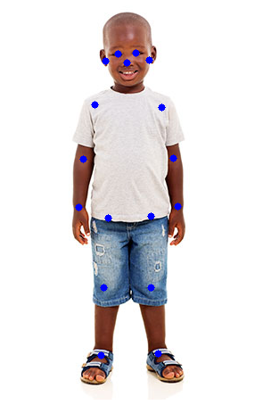

## PoseCamera

[](https://badge.fury.io/py/posecamera) [](https://github.com/Wonder-Tree/PoseCamera/actions)  [](https://www.codefactor.io/repository/github/wonder-tree/posecamera) [](https://github.com/Wonder-Tree/PoseCamera/discussions)

PoseCamera is python based SDK for multi human pose estimation through RGB webcam.

### Install

install posecamera package through pip

```python
pip install posecamera
```

If you are having issues with the installation on Windows OS then check this [page](https://wonder-tree.github.io/PoseCamera-Docs/#/pages/troubleshooting)

### Usage

> See Google colab notebook https://colab.research.google.com/drive/18uoYeKmliOFV8dTdOrXocClCA7nTwRcX?usp=sharing

draw pose keypoints on image

```python
import posecamera
import cv2

det = posecamera.pose_tracker.PoseTracker()

image = cv2.imread("example.jpg")

pose = det(image)
for name, (y, x, score) in pose.keypoints.items():
    cv2.circle(image, (int(x), int(y)), 4, (255, 0, 0), -1)


cv2.imshow("PoseCamera", image)
cv2.waitKey(0)
```

output of the above example



 

or get keypoints array

```text
for pose in poses:
    keypoints = pose.keypoints
```

Handtracker

```
import posecamera
import cv2
det = posecamera.hand_tracker.HandTracker()

image = cv2.imread("tmp/hands.jpg")
keypoints, bbox = det(image)

for hand_keypoints in keypoints:
    for (x, y) in hand_keypoints:
        cv2.circle(image, (int(x), int(y)), 3, (255, 0, 0), -1)

cv2.imshow("PoseCamera - Hand Tracking", image)
cv2.waitKey(0)
```


#### Using Docker

The official docker image is hosted on [Docker Hub](https://hub.docker.com/r/wondertree/posecamera). The very first step is to install the docker [docker](https://docs.docker.com/get-docker/) on your system.

> Also note that your Nvidia driver Needs to be compatible with CUDA10.2.

Doing inference on live webcam feed.

```bash
xhost +; docker run --name posecamera --rm --net=host --gpus all -e DISPLAY=$DISPLAY --device=/dev/video0:/dev/video0 wondertree/posecamera --video=0
```

> GPU & Webcam support \(if running docker\) is not available on Windows Operating System.

To run inference on images use the following command.

```bash
docker run --name posecamera --rm --net=host -e DISPLAY=$DISPLAY  wondertree/posecamera --images ./tmp/female_pose.jpg --cpu
```

For more details read our [Docs](https://wonder-tree.github.io/PoseCamera-Docs/)

The base of this repository is based on the following research paper.

```text
@inproceedings{osokin2018lightweight_openpose,
    author={Osokin, Daniil},
    title={Real-time 2D Multi-Person Pose Estimation on CPU: Lightweight OpenPose},
    booktitle = {arXiv preprint arXiv:1811.12004},
    year = {2018}
}
```

#### Share your thoughts

Join our [Discussion Channel](https://github.com/Wonder-Tree/PoseCamera/discussions)! We love to hear your ideas, suggestions or pull request

